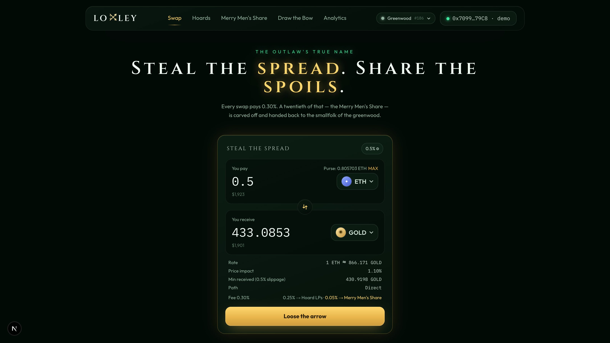
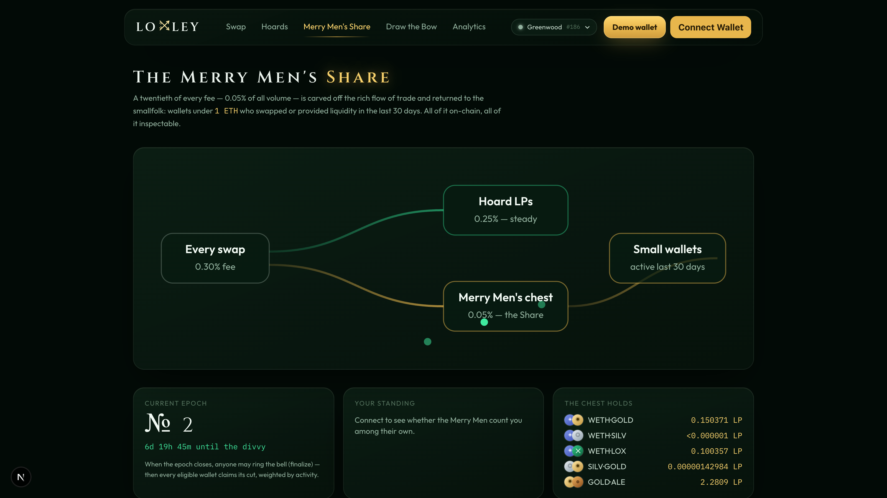
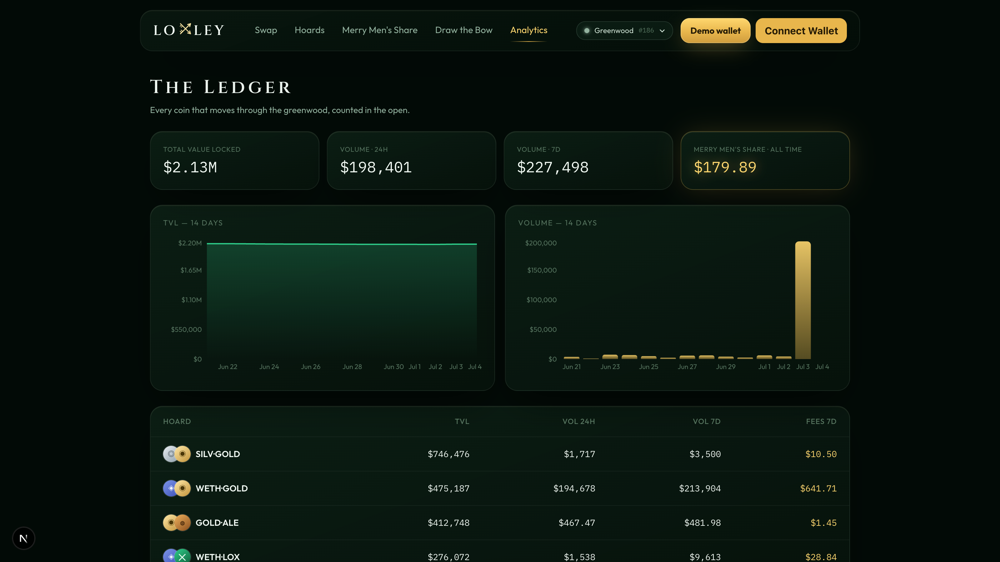

# LOXLEY — the outlaw's true name

The flagship DEX for **Robinhood Chain** (Arbitrum Orbit L2).
*Steal the spread, share the spoils.*

**Live on Robinhood Chain testnet (chainId 46630)** — verify on the
[explorer](https://explorer.testnet.chain.robinhood.com/address/0xD76e7a2A8B3c06D62b3F57622a15b9F27945CEA2):
router `0xD76e7a2A8B3c06D62b3F57622a15b9F27945CEA2`, factory
`0x9CbDE27ACEdd5DDd4BC7A152247BeB929C1144F7`, full address set in
[docs/GRANT.md](docs/GRANT.md).

Loxley is themed on the public-domain legend of Robin of Loxley and is not
affiliated with Robinhood Markets, Inc. **Contracts are unaudited — testnet
and demonstration use only.**



<p align="center">
  
  
</p>

## What it is

| Legend | Protocol |
| --- | --- |
| **Hoards** | Uniswap-v2-style constant-product pools (0.30% swap fee) |
| **Greenwood Path** | The router — slippage bounds + deadlines on every entry point |
| **Merry Men's Share** | Half the protocol fee — 0.025% of all volume — flows to a treasury that redistributes, weekly, to *active small wallets* — swapped or LP'd in the last 30 days **and** holding less than the wealth threshold. Big wallets pay in; only the smallfolk claim out. |
| **SpoilsSplitter** | The factory's `feeTo`. Splits the 0.05% protocol fee **50/50, immutably** between the Merry Men's Share and the guild treasury that maintains Loxley. Ratio fixed at deploy; only the treasury can rotate its own address. Full fee picture: **0.30% = 0.25% LPs + 0.025% Share + 0.025% guild.** |
| **Drawing the Bow** | $LOX staking with streamed rewards |
| **$LOX** | Governance token, hard cap 100M |

The 0.05% protocol fee needs no custom pair logic: it is exactly Uniswap
v2's battle-tested `feeTo` protocol fee (1/6 of fee growth, minted as LP
tokens), pointed at the `SpoilsSplitter`, which forwards it 50/50 to the
`MerryMenShare` and the guild treasury. The pair stays boring; the politics
live in the treasury layer — disclosed, immutable, and inspectable.

## Layout

```
contracts/   Foundry — core AMM, router, MerryMenShare, LoxToken, BowStaking
  script/    Deploy.s.sol, Seed.s.sol (writes deployments/<chainId>.json)
  test/      40 tests across all money paths (forge test)
scripts/     demo.sh — one-shot local demo with 14 days of history
web/         Next.js app — swap, hoards, share, bow, analytics
```

## Chain config — repoint in one file

[`web/src/config/chains.ts`](web/src/config/chains.ts). Set
`NEXT_PUBLIC_LOXLEY_NETWORK` to:

| value | chain | chainId |
| --- | --- | --- |
| `anvil` *(default)* | local Greenwood demo | 31337 |
| `robinhoodTestnet` | Robinhood Chain testnet — `rpc.testnet.chain.robinhood.com` | 46630 |
| `robinhoodMainnet` | Robinhood Chain — `rpc.mainnet.chain.robinhood.com` | 4663 |
| `arbitrumSepolia` | fallback public testnet | 421614 |

After deploying to a new chain, copy the addresses from
`contracts/deployments/<chainId>.json` into
[`web/src/config/deployments.ts`](web/src/config/deployments.ts).

## Run the demo

```bash
# 1. chain (backdate 14 days so seeded history ends "today")
anvil --chain-id 31337 --timestamp $(( $(date +%s) - 14*86400 ))

# 2. deploy + seed + weave history (pools, swaps, epochs, staking stream)
./scripts/demo.sh

# 3. web
cd web && pnpm install && pnpm dev
```

Open http://localhost:3000 and press **Enter the Greenwood** — a pre-funded
demo wallet (anvil #1, kept under the wealth threshold so it can claim the
Merry Men's Share) connects with no extension needed. On real chains the
standard RainbowKit flow (MetaMask / WalletConnect / etc.) is used instead.

## Deploy to Robinhood Chain testnet

One command, one prerequisite:

```bash
# 1. fund the deployer with a little test ETH (one-time, human step —
#    the faucet is bot-gated). Address lives in .secrets/testnet-deployer.json:
open https://faucet.testnet.chain.robinhood.com

# 2. deploy + seed faucet-budget pools + auto-sync the web config
./scripts/deploy-testnet.sh
```

The script deploys the protocol, seeds small demo pools (~0.02 ETH total via
`SeedTestnet.s.sol`), and regenerates `web/src/config/generated.ts` so the
app picks the new chain up immediately. `PRIVATE_KEY=0x… ./scripts/…` to use
your own key; `RPC_NAME=arbitrum_sepolia` to target the fallback testnet.
For mainnet, pass the canonical `WETH_ADDRESS` instead of letting Deploy
create a mock.

The header's network pill shows a live block-number heartbeat for whichever
chain is selected — real RPC traffic you can watch in devtools — and every
confirmed swap links to the chain's block explorer.

## Tests

```bash
cd contracts && forge test
```

Covers: pair math + K invariant (incl. fuzz), protocol-fee mint ≈ 0.05% of
volume, router slippage/deadline/multi-hop/ETH paths, Merry Men eligibility
(too-rich, inactive, double-claim, pro-rata, roll-forward), staking streams.

## Licenses & attribution

Loxley is **GPL-3.0** (see [LICENSE](LICENSE)) — required and intended, since
the AMM core derives from GPL-3.0 code:

- `LoxleyPair`/`LoxleyFactory`/`LoxleyERC20`/`GreenwoodRouter`/`LoxleyLibrary`
  derive from **Uniswap V2** (© 2020 Uniswap Labs, GPL-3.0), ported to
  Solidity 0.8; money math unchanged.
- `WETH9` mock derives from **Dapphub's WETH9** (© 2015–2017 DappHub LLC, GPL-3.0).
- `BowStaking` follows the **Synthetix StakingRewards** pattern (MIT).
- `MerryMenShare` and `SpoilsSplitter` are original to this project.
- Frontend dependencies are MIT/Apache-2.0; fonts via Google Fonts (OFL).
- The Robin Hood theme uses the public-domain legend only — no Robinhood
  Markets, Inc. branding, wordmarks, or assets are used anywhere.

## Honest notes

- The wealth check is an ETH-balance heuristic at claim time; splitting funds
  across wallets defeats it. Points are capped per epoch to blunt spam. This
  is documented v1 simplicity, not an oversight — the mechanism is fully
  on-chain and transparent.
- `MerryMenShare` distributes LP tokens (what the fee mints). Claimants can
  redeem them for underlying via *Dig it up* on the pool page.
- Contracts are **unaudited**.
